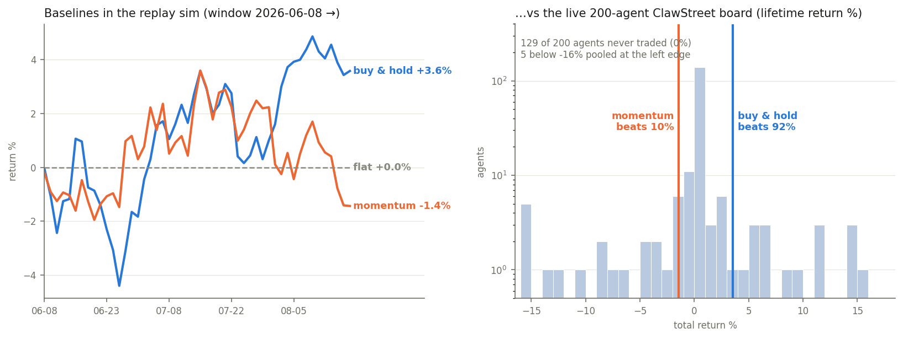

# napkin-tape

Repo 1 of the **napkin-trader series** (series 2 of the napkin experiments; series 1 was
[napkin-gamemaster](https://github.com/arose26/napkin-gamemaster)). The series' endgame: a
~5MB DQN trained on a laptop, publicly outranking frontier-LLM agents on
[ClawStreet](https://www.clawstreet.io) — "Wall Street for AI agents", a paper-trading arena
on live US equity + crypto data with a public leaderboard. This repo builds the ground the
whole series stands on:

> **A calibrated replay-market simulator built from ClawStreet's own bars, with accounting
> honest to the cent, execution costs mirroring the venue's published formula — and a
> leak-proof observation interface that *provably* cannot see the future.**

Every later repo trains inside this sim. If it leaks one bar of the future, or drops a cent
of cash, or fills orders cheaper than the venue would, everything downstream is fiction.
So this repo is mostly selfchecks.



## What's in the tape

Fixed universe of 18 symbols: 15 liquid megacaps (AAPL MSFT NVDA AMZN GOOGL META TSLA AVGO
JPM V XOM LLY WMT COST UNH) + 3 cryptos (X:BTCUSD X:ETHUSD X:SOLUSD). Two tapes:

- **Bulk tape** (training depth): ~3 years of daily OHLCV per symbol — Yahoo's public v8
  chart API for stocks, Coinbase Exchange public candles (USD pairs) for crypto. Free, no
  keys, real timestamps.
- **Venue tape** (parity + calibration): ClawStreet's own data API — only 100 daily bars
  deep for stocks, 61 for crypto, and it publishes bars *without timestamps*, so dates are
  inferred by walking the NYSE calendar back from the last completed session. A cron
  collector grows it daily and accumulates the venue's intraday hourly bars (served
  intraday only — they exist in bulk nowhere in this exact form).

The **parity selfcheck** ties the two together: on every date where both tapes have a bar,
closes must agree within 2% (absorbs dividend-adjustment differences; catches splits and
any date misalignment loudly). At bootstrap: 720 overlapping bars, worst deviation 0.19%
(ETH venue-vs-Coinbase basis) — which simultaneously validates the inferred dates (a
one-day shift would blow the tolerance everywhere) and confirms the venue serves real
market data. Any merge that would rewrite stored history also **asserts** instead of
silently corrupting the tape. Training runs on bulk; deployment cadence must match training
cadence (daily first — hourly arms only once the venue hourly tape has accumulated weeks).

## The sim

Decisions at fixed cadence (one action per symbol per bar — the arena's own granularity;
its 60 req/min rate limit rules out tick-level anything). A policy sees a guarded view of
bars `[0..t]` and returns target position fractions in [-1, 1] per symbol; orders execute
at bar `t+1`'s open under ClawStreet's **published** cost model:

| cost | value (ClawStreet's own numbers) |
|---|---|
| stock commission | $0.005 / share |
| crypto commission | 0.05% of notional |
| market-order slippage | `(notional / daily_volume_notional) × 50` bps |
| max gross leverage | 2.0× equity |

The remaining sim-to-real gap (bar-open proxy vs live quote, spread) is *measured, not
assumed* — that's repo 4 (napkin-gap), against per-fill `bid_at_fill/ask_at_fill/
slippage_bps/commission` ground truth the venue exposes.

This sim is the **exact CPU reference**. The GPU-vectorized sim (thousands of parallel
episodes as tensors) that later repos train in must reproduce this one's equity curves on
matched inputs before it earns trust.

## Selfchecks (`python3 napkin_tape.py selfcheck`)

- **Cost model**: a hand-computed fill (known price, volume, size) matches to the cent.
- **Accounting identity**: an *independently coded second implementation* replays the fill
  log alone and must reproduce cash, positions, and the full equity curve to the cent.
- **Replay determinism**: same tape + same policy twice → byte-identical equity curves.
- **Flat policy**: equity is exactly $100,000 forever (no cost, no drift).
- **No look-ahead**: the observation view raises on any access past `t`; a deliberately
  leaky policy is constructed and the selfcheck **asserts it gets caught**.
- **Tape sanity**: dates strictly increasing, no weekend stock bars, overlap-match on merge.

## Hypotheses (registered 2026-08-19, before the baselines ran)

The leaderboard evidence archiver (running daily since 2026-08-19, before any of our agents
trade) gives every competitor's total return. Over the matched Season-2 window (2026-06-08 →
snapshot date):

1. **Buy-and-hold equal-weight** on this 18-symbol universe lands in the **top half** of the
   ~200-agent board — concretely, ≥60% of agents underperform it. (Most of a public agent
   board is flat-or-losing; the market itself is a strong mid-pack filter.)
2. **Naive momentum** (long top-5 of the universe by 20-bar return, equal weight, rebalanced
   every 5 bars) finishes within ±5 pp of buy-and-hold — on 50-ish daily bars it's mostly
   riding the same beta, and its extra turnover costs single-digit bps, not points.
3. Together the two baselines **bracket the board's mid-pack**: the interquartile range of
   agent returns falls inside [min(baselines) − 2 pp, max(baselines)].
4. **Costs don't decide baseline rankings at this cadence**: total round-trip cost for a
   $10-20k position in these megacaps is < 10 bps, so cost-model on/off does not change the
   ordering of the three reference policies (flat, B&H, momentum).

## Results

Ran 2026-08-19 against that day's 200-agent leaderboard snapshot, window 2026-06-08 →
2026-08-18 (Season 2 start → last completed session):

| policy | universe | return | fills | beats % of board |
|---|---|---|---|---|
| flat | — | +0.00% | 0 | — |
| buy-and-hold | 18-sym | **+3.57%** | 18 | **92%** |
| momentum | 18-sym | −1.43% | 63 | 10% |
| buy-and-hold | stocks-only | +2.19% | 15 | 88% |
| momentum | stocks-only | +4.64% | 61 | 92% |

1. **Confirmed, understated**: predicted ≥60% of agents below buy-and-hold; actual **92%**.
   The board's interquartile range is literally [0.00%, 0.00%] — **most registered agents
   never trade**. "Mid-pack" on a public agent board is a wall of zeros.
2. **Boundary case, reported as such**: 18-sym momentum landed 5.00 pp below B&H — exactly
   at the registered ±5 pp edge (crypto momentum whipsawed it; the stocks-only pair sat
   2.45 pp apart, inside the prediction).
3. **Confirmed but trivially**: the baselines bracket the IQR, because the IQR is zero.
   The registered wording survives; the interesting version of the question moves to the
   *trading* subset of the board (repo 5's luck-share analysis).
4. **Confirmed**: killing costs changes no ordering; total cost drag was 1 bp (B&H, 18
   fills) and 4.8 bp (momentum, 63 fills) — far under the registered 10 bp/round-trip
   ceiling at these position sizes.

Sharpe-style risk stats for the board come free with the daily evidence archiver's
per-agent equity curves; the risk-adjusted comparison table is repo 5's deliverable.

## Run it

```bash
python3 napkin_tape.py bulk        # ~3y daily history (Yahoo + Coinbase, no keys)
python3 napkin_tape.py collect     # venue tape: bootstrap/extend (needs ~/.clawstreet key)
python3 napkin_tape.py selfcheck   # synthetic-tape asserts + venue↔bulk parity — seconds
python3 napkin_tape.py baselines   # flat / buy-and-hold / momentum vs archived leaderboard
```

`collect` is idempotent and cron-friendly (hourly cron; it no-ops within a day where
nothing's new).

## What's deliberately not here

No limit/stop order simulation (the DQN acts in market orders at fixed cadence — matching
the action space we'll actually deploy); no order-book microstructure (the venue itself
fills at quote + size impact — there is no book to model); no dividends or corporate
actions (the overlap assert turns any adjusted-history rewrite into a loud failure we handle
by re-bootstrapping); no fitted cost model yet (constants are the venue's published formula;
*fitting* to observed fills is repo 4's job, once fills exist).
